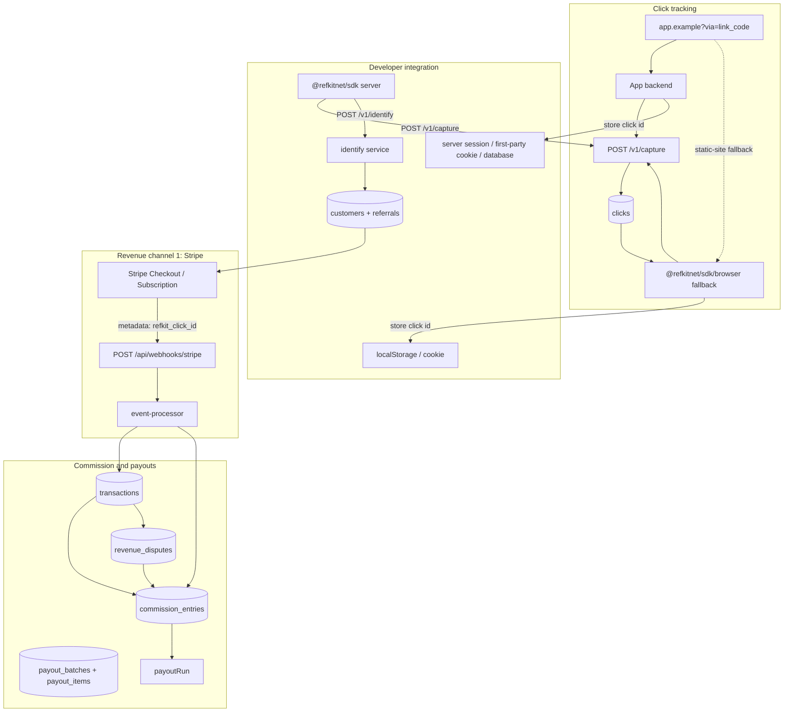

# Architecture

Internal reference for how the RefKit product app works end-to-end.

RefKit Cloud and Self-Hosted use this same application. The executable
capability boundary is `src/lib/deployment.ts`; the full dependency and egress
inventory is [editions.md](./editions.md).

## System overview

## Affiliate attribution flow

1. **Affiliate shares link** - `{destination}?via={link_code}` on the app website (any page; optional UTMs on named campaign links). The link code is unique within an App. Production links stay `?via=` only because each App owns one production tracking origin. Dashboard Test links may include `refkit_app=` when the Test URL differs from that origin.
2. **Click recorded (recommended)** - The app backend reads `via`, calls `POST /v1/capture` with its app-scoped API key and original visitor metadata, and stores the returned `click_id` in a secure session, first-party cookie, or database. Authenticated capture resolves the link with the API key's App plus `via`.
3. **Browser fallback** - Sites without practical server middleware use `@refkitnet/sdk/browser`, which captures after required consent, resolves the App from the landing-page origin (or `refkit_app` on Test links), persists `refkit_click_id` in localStorage/cookie, and strips `via` and `refkit_app` from the URL.
4. **Customer identified** - Developer's server calls `identifyCustomer()` (POST `/v1/identify`) with the stored click ID and Customer identity. Only managed provider services using managed revenue keys may instead send direct promotion-code evidence when no click is available. Ordinary App keys require a click ID. A valid click wins, and direct evidence creates a Referral with `click_id: null` rather than a synthetic click. The service creates `customers` and `referrals` rows and pins the current Program terms version on the Referral.
5. **Revenue ingestion** - Depends on `apps.revenue_source`:
   - `stripe`: app passes `getStripeMetadata()` into Stripe Checkout; verified Stripe webhooks synchronously create `transactions` and `commission_entries` in one DB transaction.
   - `api`: app backend calls `reportPayment()` / `POST /v1/transactions` after each successful charge or renewal, then reports completed refunds and dispute lifecycle changes through the matching provider-neutral endpoints.
   - Program currency must match revenue currency in V1; cross-currency conversion is rejected.
6. **Commission lifecycle** - Ordinary earned entries start `approved` and can move to `paid`; self-referrals remain flagged until reviewed, and disputes temporarily hold entries. Recurring commissions use the rule pinned on the referral. Post-payout refunds create `recovery_debt` that reduces payable balance.
7. **Payout** - Affiliates may request payouts (allocating specific commission entries). Developers see a live Ready to pay list and can keep the manual CSV plus Mark paid flow. A prepared batch can instead create one `payout_execution` per Affiliate and emit `payout.ready` to the App webhook. The external system fetches the encrypted instruction snapshot with an exact App-scoped live key and reports success or failure. Success reuses the manual Mark paid accounting path. Failure leaves entries allocated and unpaid and may later become succeeded. RefKit never moves money.
8. **Outgoing events** - Each App may configure one HTTPS webhook endpoint and selected lifecycle events. RefKit signs `timestamp.rawBody` with HMAC-SHA256, attempts one synchronous request after the business transaction commits, and records the result in `webhook_deliveries`. The three-second attempt is best-effort and has no retry, queue, worker, or cron dependency.

## Managed provider flow

Managed provider support is a Cloud-only control plane used by separately deployed, trusted services:

1. The provider HMACs its account identifier and calls `POST /v1/managed-connections/provision` with the provisioning secret and a generation-specific `Idempotency-Key`.
2. RefKit creates a non-login managed account, Organization, and API-revenue App, then returns one restricted `rk_managed_*` key plus separate Test and Live revenue keys.
3. The provider encrypts the bundle in its own database and acknowledges it. RefKit then erases the recoverable bundle. Credential rotation keeps the previous generation valid until the new bundle is acknowledged.
4. The management key can access only selected App, Program, Affiliate, link, ledger, payout, lifecycle, and privacy operations. It cannot authenticate tracking, identify, revenue writes, or Affiliate APIs.
5. Suspension and uninstall stop ordinary management and revenue access. Lifecycle and privacy operations remain available until final redaction revokes every credential, removes provider configuration and tracking data, and rewrites retained ledger anchors with non-identifying values.
6. Provider tokens, resource IDs, webhook payloads, and provider-specific types remain in the private provider service. Only opaque HMACed account, Customer, order, refund, and transaction identities cross into RefKit core.

## Developer dashboard environments

The developer dashboard has one app-scoped `test` or `live` selection. It is
persisted in local storage by `owner-context.tsx`, restores independently when
the developer changes Apps, and survives refreshes and Stripe redirects. It is the
only stored dashboard environment state. The previous onboarding-path value is
migrated into it on first read. New developers create the shared App, production
website, and default Program first. Live is selected by default, then the developer
can continue with Live or choose Test. Test setup stores a separate app-scoped
local or staging URL in the browser without changing the shared destination.

The selector is rendered only where the environment changes behavior: setup,
Overview, Affiliates, Referrals, and the environment setup section of App
settings. Programs, agreements, Network configuration, and shared website
settings do not show or respond to it. Payouts are explicitly live-only.

Overview, affiliates, clicks, referrals, transactions, and commissions pass an
explicit `environment` filter to their services. Filtering happens before
cursor pagination. Clicks and referrals use the internal Test affiliate
boundary, while transactions and commissions use `livemode`. Live reads also
exclude internal Test affiliates. Payout UI and commission-review actions are
live-only. App, Program, agreement, Network, production website, and revenue-source
configuration remain shared.

## RefKit Network flow

The official RefKit Network is Cloud-only. Its flow is:

1. A developer uploads an app logo to Cloud object storage.
2. The first program becomes the app default; developers can choose another default when multiple programs exist.
3. The developer enables app-level Network visibility for the active default program with published terms.
4. `GET /v1/network/apps` returns each visible app once with its active default program, current commission terms, and join policy.
5. A signed-in affiliate accepts the current agreement and calls `POST /v1/affiliate/programs/:programId/join`. Network join does not require the private hosted join page.
6. The join transaction creates the program affiliate record, default affiliate link, and agreement acceptance. The membership starts `pending` or `active` according to `join_page_approval`.
7. Separately, developers can enable a private hosted join page at `/join/:slug`. That link is independent of Network listing.

## Code layers

| Layer | Path | Responsibility |
|-------|------|----------------|
| Routes | `src/app/api/**/route.ts` | HTTP parsing, auth, call service, return JSON |
| Services | `src/services/**` | Business logic, orchestration, side effects |
| DB schema | `src/db/schema/**` | Drizzle table definitions |
| DB client | `src/db/client.ts` | Singleton Postgres pool (`getDb()`); cached on `globalThis` for Next dev HMR |
| Lib | `src/lib/**` | Auth, env, money, errors, IDs, pagination |
| UI | `src/app/(dashboard)/**`, `src/app/affiliate/**` | Developer Overview (setup wizard + metrics), App hub (website/billing/install/status), Programs, flat Affiliates/Referrals/Payouts; affiliate portal |
| Emails | `src/emails/**`, `src/services/emails/**` | react-email templates + delivery |

## Services map

| Service | Path | Domain |
|---------|------|--------|
| Organizations | `src/services/organizations/` | Org CRUD, members, developer emails |
| Apps | `src/services/apps/` | App CRUD, edition-aware logo storage, mode-aware test integration and production readiness status |
| Network | `src/services/network/` | Cloud-only listed-program discovery |
| Programs | `src/services/programs/` | Program CRUD, pause/resume/disable, versioned terms |
| Affiliates | `src/services/affiliates/` | Affiliate CRUD, one internal Test affiliate per Program, approve/disable/enable, compliance, multi-link |
| Clicks | `src/services/clicks/` | Click logging (campaign snapshot), listing |
| Referrals | `src/services/referrals/` | Referral listing |
| Identify | `src/services/identify/` | Customer identification, Stripe metadata |
| Managed connections | `src/services/managed-connections/` | Cloud-only provisioning, credentials, lifecycle, and final redaction |
| Managed data subjects | `src/services/managed-data-subjects/` | Allowlisted Customer, click, and ledger export plus idempotent mapping redaction for managed providers |
| Transactions | `src/services/transactions/` | Revenue transaction records |
| Revenue | `src/services/revenue/` | API-reported payments, shared commission ledger |
| Commissions | `src/services/commissions/` | Commission entries and self-referral review |
| Payouts | `src/services/payouts/` | Payout requests, runs, CSV, item resolution, encryption |
| Outgoing webhooks | `src/services/webhooks/` | Endpoint configuration, URL safety, signing, one-attempt delivery history |
| Stripe | `src/services/stripe/` | Connect, webhooks, attribution, fixtures, exchange rates |
| API keys | `src/services/api-keys/` | App and affiliate API key management; `rk_test_app_*` for local/staging and `rk_app_*` for production |
| Admin | `src/services/admin/` | Admin gate, audit logging |
| Users | `src/services/users/` | User lookup |
| Emails | `src/services/emails/` | Template rendering + delivery (log or Resend) |
| Audit | `src/services/audit/` | Admin audit log writes |
| Scoping | `src/services/scoping/` | Org/app/program access scoping helpers |

## Database tables

Grouped by domain. All defined in `src/db/schema/`.

### Auth and users

| Table | Purpose |
|-------|---------|
| `users` | Shared user identities, verification state, and primary developer/affiliate mode |
| `sessions` | Better Auth sessions |
| `accounts` | Better Auth linked accounts |
| `verifications` | Magic link tokens |
| `device_codes` | CLI device authorization flow |

### Account registration and routing

1. `/sign-up` collects name, email, and a primary mode, then `POST /api/auth/register` creates or updates an unverified user.
2. Better Auth sends a signup-specific magic link. Magic-link verification marks the pre-created user verified and creates the session; magic-link sign-in cannot create users.
3. Organization membership grants developer access and affiliate program membership grants affiliate access. The same user may have both.
4. Accounts with only one available mode land there. Accounts with both modes, or no memberships yet, land in their stored primary mode. Admin routing still takes precedence.
5. `/sign-in` returns a generic success response for unknown email addresses but sends no email and creates no user.

### Organization and apps

| Table | Purpose |
|-------|---------|
| `organizations` | Developer organizations |
| `organization_members` | Org membership |
| `apps` | Apps within an organization, including public logo URL |
| `managed_accounts` | Non-login Cloud principals scoped to one Organization and App |
| `managed_connections` | Provider-neutral installation generation, lifecycle, and pending credential acknowledgement state |
| `managed_data_subject_redactions` | Opaque idempotency receipts kept separately from deleted Customer mappings |
| `api_keys` | Hashed App, Affiliate, and managed administration keys; App-key prefixes encode Test/Live mode |

A stable provider account maps to one non-redacted managed account,
Organization, and App across installation generations. Reprovisioning rotates
credentials when needed instead of creating another App. Final redaction is a
terminal generation boundary.

### Programs and affiliates

| Table | Purpose |
|-------|---------|
| `programs` | Affiliate programs per app |
| `commission_rules` | Commission rate/window rules per program (versioned via terms) |
| `program_terms_versions` | Immutable published program commission snapshots |
| `app_agreement_versions` | Immutable published app affiliate agreement text |
| `affiliate_agreement_acceptances` | Affiliate acceptance of an app agreement version |
| `program_affiliates` | Program affiliate memberships; `is_test` marks the one internal Test affiliate per Program |
| `affiliate_links` | Affiliate links (default + named campaign links) |
| `affiliate_payout_details` | Encrypted payout info keyed by exact Program-Affiliate membership + method + currency |
| `affiliate_promotion_codes` | Stripe promotion code mapping |

### Tracking and attribution

| Table | Purpose |
|-------|---------|
| `clicks` | Click events from affiliate links |
| `customers` | Identified Customers and non-identifying referral anchors per App |
| `referrals` | Customer attribution, with a nullable click for direct promotion-code evidence |

### Revenue (channel-agnostic)

| Table | Purpose |
|-------|---------|
| `transactions` | Revenue events (amount, currency, channel reference) |
| `revenue_disputes` | Provider-neutral dispute identity and lifecycle state |
| `commission_entries` | Commission line items (earned, reversed, disputed, reinstated) |

### Stripe (channel #1)

| Table | Purpose |
|-------|---------|
| `stripe_connections` | Connected Stripe accounts per app |
| `pending_stripe_installs` | Short-lived RefKit app bind started from Connect / Reconnect |
| `stripe_app_authorizations` | `account.application.authorized` installs waiting to be claimed |
| `stripe_events` | Durable synchronous webhook processing and recovery ledger |

### Payouts

| Table | Purpose |
|-------|---------|
| `payout_requests` | Affiliate-initiated payout requests |
| `payout_request_items` | Commission entries allocated to a request |
| `payout_batches` | Internal grouping and audit records for developer-prepared payouts |
| `payout_items` | Per-entry line items in a batch (with payment-instruction snapshot) |
| `payout_executions` | One external payout lifecycle per batch and Program affiliate, with an encrypted instruction snapshot |
| `webhook_endpoints` | One encrypted-secret outgoing webhook configuration per App |
| `webhook_deliveries` | Payload and result ledger for each single delivery attempt |

### Infrastructure

| Table | Purpose |
|-------|---------|
| `admin_audit_logs` | Admin action audit trail |
| `rate_limits` | Rate limiting state |

## Email delivery

Outbound mail goes through `deliverEmail()` (`src/services/emails/deliver.ts`). Full catalog: [emails.md](./emails.md).

| Kind | Delivery |
|------|----------|
| User-triggered / auth | In-request (sync) |
| Scheduled | Not used in phases 0–1 |

Localhost (or `EMAIL_DELIVERY=log`) logs instead of calling a provider. Cloud
uses RefKit-operated Resend. Self-Hosted production requires operator SMTP or
Resend credentials and has no RefKit fallback. Administrators can send a
diagnostic through `POST /v1/admin/email-diagnostic`.

## Stripe event processing

1. Store the verified event in `stripe_events` with `pending` status.
2. Atomically claim it as `processing` and increment its attempt count.
3. Re-fetch Stripe objects and create money records under existing idempotency constraints.
4. Mark it `processed`, or persist `failed` plus the error and return `5xx` so Stripe redelivers.
5. Admin → Stripe events highlights failures and events stuck for five minutes and retries them directly.

## Wrapper surfaces

These packages call the REST API but contain no business logic:

| Package | Path | Transport |
|---------|------|-----------|
| SDK | `packages/sdk` | HTTP (server capture/identify/revenue helpers plus browser capture fallback) |
| CLI | `packages/cli` | HTTP (all commands via `api.ts`) |
| MCP | `packages/mcp` | HTTP (tool handlers → API calls) |

Self-Hosted clients set the instance origin explicitly. CLI and MCP use
`REFKIT_API_URL` or the stored CLI origin. Browser and server SDK calls use
`baseUrl`. Custom-origin help output does not fall back to RefKit Cloud links.

See `AGENTS.md` for the change-propagation rule when modifying the API.

## Auth summary

| Actor | Auth method | Scope |
|-------|-------------|-------|
| Developer (dashboard) | Session cookie | Own orgs, apps, programs |
| Developer (API) | `rk_test_app_*` or `rk_app_*` key | App-scoped test or live access; test keys create non-payable API revenue |
| Managed provider | `rk_managed_*` key | Selected owner, lifecycle, and privacy operations for one active Cloud connection |
| Managed provider revenue | Managed `rk_test_app_*` or `rk_app_*` key | Test or Live tracking, identify, and API revenue for one active connection |
| Affiliate (portal) | Session cookie | Own affiliate data |
| Affiliate (API) | `rk_aff_*` key | Own links, balance, payout details |
| CLI user | Bearer token (device flow) | Same as session |
| MCP agent | Bearer token or affiliate key | Same as CLI |
| Admin | Session + database administrator flag; Cloud also requires allowlist | All data via `/v1/admin/*` |
| Dev fixture | `DEV_API_SECRET` bearer | Local/test Stripe fixture endpoints only |
| Stripe | Webhook signature | Event ingestion only |

## Related docs

- [../PRODUCT.md](../PRODUCT.md) - product rules still in force
- [api.md](api.md) - endpoint reference
- [editions.md](editions.md) - deployment capabilities and hosted-assumption inventory
- [stripe.md](stripe.md) - Stripe revenue channel
- [testing.md](testing.md) - test suites
- [../AGENTS.md](../AGENTS.md) - agent working rules
- [Self-Hosted guides](../../../docs/self-hosting/README.md) - deployment and operations
