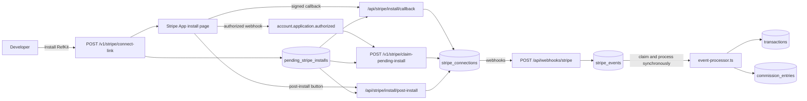

# Stripe - Revenue Channel #1

Stripe is the first managed revenue connector in RefKit. It maps payment, refund, and dispute events into the same provider-neutral transaction, dispute, and commission services used by API reporting.

## Overview



RefKit is a backend-only **Stripe App**, not a payments platform. Each developer installs RefKit on an existing Stripe account and grants explicit read permissions. RefKit ingests webhook events, attributes revenue to affiliates via click metadata, and creates transactions + commission entries. RefKit does not create Stripe accounts, process charges, control payouts, move funds, or pay affiliates through Stripe.

## Key files

| File | Purpose |
|------|---------|
| `src/services/stripe/client.ts` | Stripe SDK client factory |
| `src/services/stripe/config.ts` | Runtime mode (live vs fixture) |
| `src/services/stripe/connected-accounts.ts` | Stripe App install flow and connection management |
| `src/services/stripe/event-processor.ts` | Webhook event → transaction + commission logic |
| `src/services/stripe/attribution.ts` | Resolve click/referral from Stripe metadata |
| `src/services/stripe/fetcher.ts` | Abstraction over live Stripe API vs fixtures |
| `src/services/stripe/fixtures.ts` | In-memory fixture objects for test/dev |
| `src/services/stripe/exchange-rates.ts` | Currency conversion for multi-currency |
| `src/services/stripe/test-inject.ts` | Dev endpoint payload builders |
| `src/app/api/webhooks/stripe/route.ts` | Webhook receiver (signature verification) |
| `src/app/api/v1/stripe/connect-link/route.ts` | Returns a state-bound Stripe App install URL and stores a pending install |
| `src/app/api/v1/stripe/claim-pending-install/route.ts` | Claims an authorized Stripe install for the pending RefKit app |
| `src/app/api/v1/stripe/disconnect/route.ts` | Marks a live or test Stripe connection as disconnected |
| `src/app/api/stripe/install/callback/route.ts` | Verifies the signed install callback and stores `account_id` |
| `src/app/api/stripe/install/post-install/route.ts` | Finishes install from Stripe's post-install button using the session |
| `src/lib/stripe-connect-install.ts` | Dashboard helper: navigate to Stripe install and return via redirect |
| `src/db/schema/stripe.ts` | `stripe_connections`, `pending_stripe_installs`, `stripe_app_authorizations`, `stripe_events` |

## Stripe App installation

RefKit Cloud uses a backend-only Stripe App with `stripe_api_access_type=platform` and granular read permissions. The install page lets a developer choose an existing Stripe account and approve only the data RefKit reads. It does not create or activate a payment account and does not request payment or payout capabilities. Operated Stripe App packaging and credentials are maintained separately from the public core repository.

Flow:

1. Developer calls `POST /v1/stripe/connect-link` (session or app key).
2. RefKit stores a short-lived pending install, then adds a signed CSRF `state`, the selected dashboard mode, and the approved callback URI to the Stripe App install link.
3. The dashboard navigates this tab to Stripe. After install, Stripe redirects back to the developer's RefKit page (`return_to`) with `stripe=connected` (or `stripe=error`). If the browser stays on Stripe, `POST /v1/stripe/claim-pending-install` or the post-install Return to RefKit button can still finish the bind.
4. The developer selects an existing Stripe account and accepts the read permissions.
5. Stripe should redirect to `/api/stripe/install/callback` with `user_id`, `account_id`, `state`, and `install_signature`. RefKit verifies both signatures and confirms that the authorization mode matches the signed expected mode before storing `account_id` in `stripe_connections`.
6. If the browser stays on Stripe (no redirect), Stripe still sends `account.application.authorized`. RefKit records that authorization but does not bind it from the webhook, because the webhook cannot prove which RefKit app started the install. Binding then completes through an authenticated path: the signed callback, the waiting dashboard poll (`claim-pending-install`, which binds only when this developer is the sole install in flight), or the post-install button.
7. The Stripe App manifest also defines `post_install_action` → `/api/stripe/install/post-install`, so Stripe can show a Return to RefKit button that finishes the bind using the logged-in session.
8. Webhook `account.application.deauthorized` disconnects the installation on uninstall. Developers can also disconnect from RefKit with `POST /v1/stripe/disconnect` (required before switching `revenue_source` to `api` while live Stripe is connected).

Setup checklist: `GET /v1/apps/:id/setup-status` reports program launch, API key, clicks, identify, Stripe connection, and commission health. Stripe is optional for click/signup tracking and required for payment attribution.

RefKit Cloud supplies its reviewed `STRIPE_APP_INSTALL_URL` through private deployment configuration. The public checkout contains no install identifier or Stripe credential. Managed Stripe is unavailable in the first Self-Hosted release.

## Webhook ingestion

**Endpoint:** `POST /api/webhooks/stripe`
**Auth:** Stripe webhook signature (`STRIPE_CONNECT_WEBHOOK_SECRET` for live, `STRIPE_CONNECT_WEBHOOK_SECRET_TEST` for test). The endpoint verifies against every configured secret so live and test Connected-accounts destinations can share one URL (`src/services/stripe/webhook-verify.ts`).

Register the same URL twice in the RefKit Stripe Dashboard:

| Mode | Destination | Signing secret env |
|------|-------------|--------------------|
| Live | Connected accounts → `https://app.refkit.net/api/webhooks/stripe` | `STRIPE_CONNECT_WEBHOOK_SECRET` |
| Test | Connected accounts → `https://app.refkit.net/api/webhooks/stripe` | `STRIPE_CONNECT_WEBHOOK_SECRET_TEST` |

Developer setup ("Test payment received") depends on the **test** destination. Live-only registration leaves test Checkout / `invoice.paid` events undelivered.

The endpoint must be registered as a Connect webhook (`connect: true`) so it receives connected-account events. Event payloads carry a top-level `account` field identifying the connected account. Every follow-up Stripe API call must set the `Stripe-Account` header.

`account.application.authorized` is handled even when no `stripe_connections` row exists yet: RefKit stores a `stripe_app_authorizations` row for a later authenticated claim, but does not bind it to a pending install from the webhook itself. Other events for unknown accounts are acknowledged and skipped.

Flow:

1. Verify signature against every configured Connect webhook secret.
2. Detect connected account from the `account` field.
3. Store raw event in `stripe_events` (idempotent on Stripe event ID).
4. Atomically claim the event and process it in the webhook request.
5. Mark the event `processed` and return 2xx only after processing succeeds.
6. On failure, persist the attempt and error, mark the event `failed`, and return 5xx so Stripe redelivers it.

Event handlers re-fetch the Stripe object (invoice, charge, subscription) via the API before creating money records. Test-mode events use `STRIPE_SECRET_KEY_TEST` when set; otherwise they fall back to `STRIPE_SECRET_KEY`. Duplicate deliveries and manual retries remain idempotent. Events in `pending` or `processing` for more than five minutes are considered stuck and may be retried from Admin.

Admin can list events (`GET /v1/admin/stripe-events`), filter to events needing attention with `attention_only=true`, and directly retry an event (`POST /v1/admin/stripe-events/:id/reprocess`).

## Handled event types

| Event type | Action |
|------------|--------|
| `checkout.session.completed` | One-time purchase → transaction + earned commission |
| `checkout.session.async_payment_succeeded` | Async payment completion (same as above) |
| `invoice.paid` | Subscription payment (first + renewals) |
| `charge.refunded` | Proportional commission reversal |
| `charge.dispute.created` | Mark related entries as `disputed` |
| `charge.dispute.closed` | Lost → dispute reversal entry; won or `warning_closed` → restore entries |
| `charge.dispute.funds_reinstated` | Reinstatement entry if funds returned |
| `account.application.authorized` | Record install authorization; binding happens through an authenticated claim, not from the webhook |
| `account.application.deauthorized` | Mark Stripe connection as disconnected |

Processor entry point: `processStoredStripeEvent()` in `event-processor.ts`.

## Attribution

Revenue is attributed to affiliates via Stripe object metadata set during checkout:

1. App backend reads `?via=` from the landing URL, records a click with authenticated `captureClick()`, and keeps the returned `click_id` in secure first-party storage. The link code identifies the Program.
2. For sites without practical server middleware, the browser SDK remains a fallback that records and persists the click after required consent.
3. Server SDK `identifyCustomer()` creates customer + referral and returns Stripe metadata including `refkit_click_id`.
4. Developer passes these into Stripe Checkout `metadata` or `subscription_data.metadata`.
5. On webhook, `attribution.ts` reads metadata from the Stripe object and resolves the click → referral → affiliate chain.

If metadata is missing or click is expired, the event is stored but no commission is created.

### Promotion-code fallback

Optional per-program setting. When enabled, a mapped `discount.promotion_code` may fill otherwise-missing attribution for that Program. It never replaces metadata attribution or changes the Affiliate already pinned to a referral.

RefKit has read-only permissions and cannot create Stripe coupons or promotion codes. V1 maps developer-created codes via `affiliate_promotion_codes`.

## Commission lifecycle from Stripe events

| Step | What happens |
|------|-------------|
| Earned | `checkout.session.completed` or `invoice.paid` creates `transactions` + immediately `approved` commission entries |
| Payable | Approved live-mode entries are immediately available for payout requests |
| Refunded | `charge.refunded` creates proportional reversal entry |
| Disputed | `charge.dispute.created` parks entries in `disputed` status |
| Dispute resolved | Won → restore; lost → `dispute_reversal` entry |

Refunds and disputes share the payment balance. Cumulative refunds plus disputes that are opened or lost cannot exceed the original payment. Overlapping disputes keep the earned commission held until every open dispute resolves.

Refund and dispute events received before their payment remain `failed` in `stripe_events`. They can be reprocessed after the parent payment arrives. Paid Checkout events also remain retryable until RefKit can resolve the charge used to match later child events.

Recurring commissions respect the commission rule window (`recurring-window.test.ts`).

## Fixture mode (local / test)

RefKit platform billing is out of scope. You do not need Stripe keys to develop attribution and commission flows locally.

Fixture mode is automatic when `APP_URL` is localhost and platform Stripe keys are not all set. Override with `STRIPE_FIXTURE_MODE=true|false`.

| Capability | Fixture mode | Live mode |
|------------|-------------|-----------|
| Webhook processing | Yes (via inject endpoint) | Yes (real webhooks) |
| Account connection | Sandbox connect endpoint | Stripe App install link |
| API re-fetch | In-memory objects | Live Stripe API |

**Dev endpoints** are local/fixture-only. Inject requires a `DEV_API_SECRET` bearer; sandbox connect accepts either that bearer or an authorized dashboard session:

- `POST /api/dev/stripe/sandbox-connect` - create sandbox Connect connection
- `POST /api/dev/stripe/inject` - inject a fixture webhook event

Vitest sets `STRIPE_FIXTURE_MODE=true` in `tests/setup/env.ts`.

### Local fixture workflow

1. Complete click + identify for an app.
2. Sandbox connect:

```bash
curl -X POST http://localhost:3000/api/dev/stripe/sandbox-connect \
  -H "Authorization: Bearer $DEV_API_SECRET" \
  -H "Content-Type: application/json" \
  -d "{\"app_id\":\"app_...\"}"
```

3. Inject checkout (replay the same `session_id` to test dedupe):

```bash
curl -X POST http://localhost:3000/api/dev/stripe/inject \
  -H "Authorization: Bearer $DEV_API_SECRET" \
  -H "Content-Type: application/json" \
  -d "{
    \"scenario\": \"checkout.session.completed\",
    \"app_id\": \"app_...\",
    \"amount\": 5000,
    \"currency\": \"usd\",
    \"metadata\": {
      \"refkit_click_id\": \"clk_...\",
      \"refkit_customer_id\": \"rcus_...\",
      \"refkit_program_id\": \"prg_...\"
    }
  }"
```

4. Confirm the inject response reports `processing_status: "processed"`.
Refund fixture: inject `charge.refunded` with the fixture `charge_id` from the checkout.

**Test-mode rules:** sandbox connections use `livemode=false`; those commissions are never payable. A live authorization cannot satisfy Test mode, and a test authorization cannot satisfy Live mode.

Cloud promotion validates the operated Stripe connection in private automation against an immutable public candidate. Public tests use fixture mode and never require Stripe credentials.

## Environment variables

| Variable | Required | Notes |
|----------|----------|-------|
| `STRIPE_SECRET_KEY` | Production | Live Stripe App developer account secret key (`sk_live_...` or restricted live key) |
| `STRIPE_SECRET_KEY_TEST` | Production | Test platform secret key (`sk_test_...`) for re-fetching test connected-account objects |
| `STRIPE_APP_INSTALL_URL` | Cloud production | Reviewed Stripe App install URL supplied by the Cloud deployment |
| `STRIPE_APP_SECRET` | Production | Stripe App signing secret (`absec_...`) used to verify installs |
| `STRIPE_CONNECT_WEBHOOK_SECRET` | Production | Live Connected-accounts webhook signing secret |
| `STRIPE_CONNECT_WEBHOOK_SECRET_TEST` | Production | Test Connected-accounts webhook signing secret |
| `STRIPE_FIXTURE_MODE` | Optional | `true` for local/test without Stripe keys |
| `DEV_API_SECRET` | Optional, local only | Bearer secret for local Stripe fixture endpoints and validation scripts |

Validated in `src/lib/env.ts`. `getStripeEnv()` / webhook helpers throw if the platform secret key or at least one Connect webhook secret is missing (unless fixture mode).

## SDK integration (not a Stripe replacement)

The SDK helps developers pass attribution metadata into Stripe Checkout for Stripe apps, and report payments directly for API-reported revenue apps.

```typescript
// Browser: capture click
import { init, capture } from "@refkitnet/sdk/browser";
init();
await capture();

// Server: identify customer
import { identifyCustomer } from "@refkitnet/sdk";
const identified = await identifyCustomer({
  apiKey,
  clickId,
  userId,
  email,
});

// At checkout: pass metadata to Stripe
const metadata = identified.stripe_metadata;
// → click, customer, and program IDs used by webhook attribution
```

## Adding a future channel (#2, #3, ...)

When a second revenue channel is added:

1. Create `src/services/<channel>/` with the same sub-modules: `client`, `config`, `event-processor`, `attribution`, `fetcher`, `fixtures`.
2. Add connection table in `src/db/schema/` (like `stripe_connections`).
3. Add event table for idempotent ingestion (like `stripe_events`).
4. Add webhook route at `/api/webhooks/<channel>`.
5. Reuse the existing transaction → commission → payout pipeline.
6. Document as channel #N. Consider renaming this file to `revenue-channels.md`.

## Related docs

- [architecture.md](architecture.md) - end-to-end flow
- [api.md](api.md) - Stripe and admin endpoints
- [editions.md](editions.md) - Cloud and Self-Hosted capability boundary
